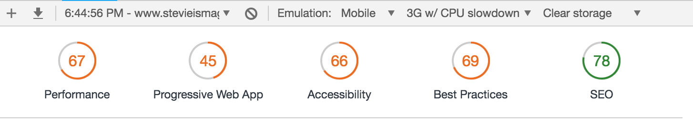

# Learning-Links

<strong>This project was built using [Turbo360](https://www.turbo360.co). I wouldn't have completed this project as quickly without Dan's guidance. You should definite check out his efforts over at [Turbo360](https://www.turbo360.co).
<strong>

***

## Performance Audit

`Initial Audit`

## To-Do
* ~~Google Analytics~~

* ~~Landing Jumbotron Section~~
* Articles Section
  1. regex for https link validation
  2. ~~add http to schema~~
  3. ~~front end - connect button to respective link~~
  4. Size photos appropriately for mobile
  5. conditional render - if scrape doe not render MetaData - 'This link is a surprise. Do you dare click it ?' 

*  App Section
  1. Images / Links 

* Get In Touch Section
  1. ~~Add Social Media links~~

